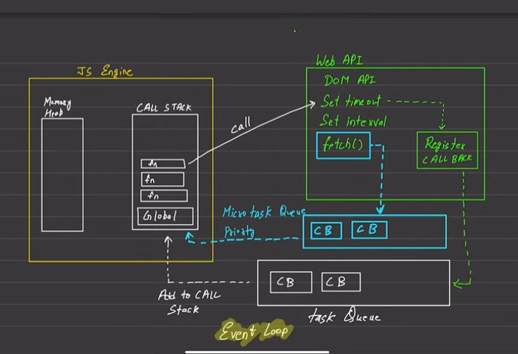

# Asynchronous Js
[Download PDF](https://drive.google.com/drive/folders/1nweZ9gZBRqqgPfdPCLJbJPrfuAARV_8e)


## Synchronous
- Tasks are completed one after another, in the order they appear.
- The next task waits until the current task is done.
  

## Asynchronous :

- Tasks don’t wait for each other. While one task is being processed, JavaScript can start another.
- Useful for tasks that take time, like fetching data or waiting for a timer.


## Key Basics:
1) Callback
2) Promise
3) Async/Await

## Why Use Asynchronous Code?
- Speed: JavaScript doesn’t pause; it keeps running other tasks.
- Smooth UI: Prevents your app from freezing while waiting for something, like server data.
  
# Global Execution Context (GEC)
- The Global Execution Context is the default environment where your JavaScript code runs when the script starts executing.

- It’s created by the JavaScript engine before any code is executed.
  
## How Does It Work?
- When the JavaScript engine starts running your code: It creates the Global Execution Context.
  
- Phases of GEC:
1) Creation Phase:
   - Allocates memory for variables and functions.
   - Variables are initialized as undefined.
  
2) Execution Phase:
   - Executes the code line by line.
   - Updates the values of variables.
  

---



---

# 1. Call Stack
- The call stack is a data structure that keeps track of function calls in the order they need to be executed.
- When a function is invoked, it is added to the stack.
Once the function completes, it is removed from the stack.
Key Points:
- The stack operates in Last In, First Out (LIFO) order.
- If the stack is full (e.g., due to infinite recursion), you get a stack overflow error.

#### Example:
```javascript
function first() {
  console.log('First function');
}

function second() {
  first();
  console.log('Second function');
}

second();

```
### Call Stack Execution:

- second() is pushed to the stack.
- first() is pushed to the stack.
- first() completes and is removed.
- second() completes and is removed.

#### Output:
``` javascript
First function
Second function
```

# 2. Web APIs
- Web APIs are provided by the browser to handle asynchronous tasks like:
   - Timers (setTimeout, setInterval).
   - HTTP requests (via fetch or XMLHttpRequest).
   - DOM events (e.g., onclick, onload).
### How They Work:
- When an asynchronous operation is triggered, the JavaScript engine sends the task to the Web API environment.
- The Web API handles the operation independently of the call stack.
- Once the task completes, a callback function is sent to the callback queue.
  
#### Example:
```javascript
Copy code
console.log('Start');

setTimeout(() => {
  console.log('Timer finished');
}, 1000);

console.log('End');
```
### Execution:

- console.log('Start') runs and is removed from the stack.
- setTimeout is passed to the Web API, and the timer starts.
console.log('End') runs and is removed.
- After 1 second, the setTimeout callback is pushed to the callback queue.


#### Output:
```javascript
Start
End
Timer finished
```

# 3. Callback Queue
- The callback queue stores callback functions from Web APIs once their tasks are complete.
- The event loop moves these callbacks to the call stack only when the stack is empty.
- 
#### Example with Event Order:
```javascript

console.log('Start');

setTimeout(() => {
  console.log('Callback 1');
}, 0);

console.log('End');
```

#### Execution Flow:

- console.log('Start') is executed.
- setTimeout sends the callback to the Web API.
- console.log('End') is executed.
- Once the stack is empty, the callback is moved from the callback queue to the stack and executed.
  
#### Output:
```javascript
Start
End
Callback 1

```

# 4. Microtask Queue
- The microtask queue is a special queue for tasks like:
   - Promises (Promise.then or Promise.catch).
   - Mutation Observers.
- Microtasks have higher priority than tasks in the callback queue.
- All microtasks are executed before moving to the callback queue.
  
#### Example:
```javascript

console.log('Start');

setTimeout(() => {
  console.log('Callback');
}, 0);

Promise.resolve().then(() => {
  console.log('Microtask');
});

console.log('End');

```

#### Execution Flow:

- console.log('Start') runs.
- setTimeout sends its callback to the Web API.
- Promise.resolve adds its .then callback to the microtask queue.
- console.log('End') runs.
- The microtask queue executes 'Microtask'.
- The callback queue executes 'Callback'.
#### Output:
```js
Start
End
Microtask
Callback

```

# 5. Event Loop
- The event loop is the mechanism that:
- Continuously checks the call stack.
- Moves tasks from the microtask queue and callback queue to the call stack.
  
### How It Works:
- The event loop checks if the call stack is empty.
- If the stack is empty:
   - Microtasks (if any) are moved to the stack and executed.
   - Then, tasks from the callback queue are moved to the stack.
  
#### Example of Event Loop Behavior:
```javascript
console.log('Start');

setTimeout(() => {
  console.log('Callback Queue Task');
}, 0);

Promise.resolve().then(() => {
  console.log('Microtask Queue Task');
});

console.log('End');

```

#### Event Loop Flow:

- 'Start' is logged.
- The setTimeout callback is sent to the Web API.
- The .then callback is added to the microtask queue.
- 'End' is logged.
- Microtask ('Microtask Queue Task') runs.
- Callback queue task ('Callback Queue Task') runs.
  
#### Output:
```js

Start
End
Microtask Queue Task
Callback Queue Task
```

# Conclusion
- **Call Stack** :  Executes synchronous code.
  
- **Web APIs** : Handle asynchronous tasks.
  
- **Callback Queue** : Stores asynchronous callbacks.
  
- **Microtask Queue** : Executes higher-priority tasks (like promises).
  
- **Event Loop** : Ensures non-blocking execution by coordinating these components.